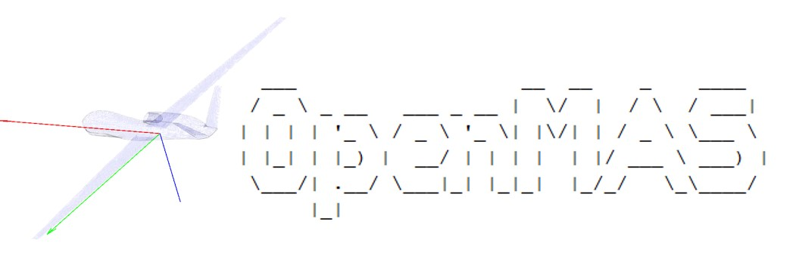

An open-source modelling environment for simulating multi-agent systems with 
complex agent decision mechanics and dynamic behaviour.

Author:	
James A. Douthwaite Ph.D MEng,
University Of Sheffield,
Department of Automatic Control & Systems Engineering,
United Kingdom

For queries regarding the project, please email me at: douthwaiteja@gmail.com
 
%%% GENERAL README %%%

OpenMAS is an open-source multi-agent simulator for Matlab. This software package provides a number of tools necessary for the simulation of multi-agent systems with complex agent definitions. The software packages environment is based upon Matlab's object orientated functionality; allowing users to build and define their own agent definitions and simulate their interactions in defined scenarios.
	
|  Quadcopter dynamics |  Boids flocking|
| --- | --- |
|  Interval Avoidance (IA)|  Optimal Reciprocal Avoidance (ORCA)|

%%% TO RUN %%%

- To test run the simulator with an example agent, run 'example_setup.m'.
- Alter the "setup" file to define different scenarios and unique agent combinations.

%%% DIRECTORY OVERVIEW %%%

This file is intended to provide an brief introduction to this opensource multi-agent
simulation (OpenMAS) tool. This directory contains a number of folders that 
together form a framework for the simulation of generic multi-agent scenarios.  
Inside this directory:

- environment 
	+ The directory containing the simulation functions and utilities.
	[it is advised you do not change anything within this folder]

- objects   
	+ The directory of user/default object and agent definitions.

- scenarios 
	+ A directory of scenario definitions. Functions within here are 
	  designed to generate the object initial conditions in the global
	  coordinate system. Scenario.fig, scenario.mat may be auto generated.
- data 
	+ A directory that may be auto-generated, either in the repo directory or on the users desktop, but may assigned using the "outputPath" parameter.

IMPORTANT: When running the simultion, it will attempt to find all the associated paths in the git directory, please do not rename the main files.

%%% SIMULATION PROCEDURE %%%

An overivew of the complete process:
1. Add the set of directories to the path of your script [i.e 'addpath('objects')'] 
	(Some of these will be added automatically).
2. Define the matrix of initial states using the 'scenarioBuilder' or use and existing 
		scenario defined in /scenarios.
3. Initialise the array of objects/agents with these initial conditions by passing a cell array of objects to that scenario.
4. Pass the array to the simulation with additional simulation parameters via the simulation wrapper function 'simulation_initialise' as shown in 'example_setup.m'.
5. Find the output DATA and META structures, in addition to selected figures within the directory "data" (unless explicitly stated to output elsewhere).

This process can be seen described in 'example_setup.m'.

%%% FIGURES OUTPUT GENERATION %%%

By default, OpenMAS will create figures for the scenario upon completion. These figures are generated by passing a cell array of labels to the simulation wrapper using the "figures" arguement. The default list of available figures is given below:

- 'ALL' 			+ Outputs all available figures.
- 'EVENTS' 			+ A summary of the simulation events that occured over the 
					  simulation time.
- 'COLLISIONS'   	+ Snapshots of the the collision instances between agents.
- 'TRAJECTORIES' 	+ Produces a timeseries plot of each agents global state trajectories.
- 'SEPARATIONS'  	+ The inter-agent seperations from the perspective of each agent.
- 'CLOSEST'		 	+ A comparison of the two closest agents over time.
- 'INPUTS'			+ The control input trajectories, if stored to the agent.DATA property.
- 'PLAN'			+ A simple top-down trajectory figure for all agents.
- 'ISOMETRIC' 		+ An isometric summation of the global agent trajectories.
- 'GIF'				+ An animation of the isometric view.
- 'AVI'				+ An vidoe of the time series from the global prospective as a .avi.
- 'TIMES'			+ Plots of the computation times, if stored to the agent.DATA property.
- 'NONE'			+ Supress figures intentionally.

%%% EXAMPLE %%%

Below is an example of passing figure requests to OMAS_initialise:

[DATA,META] = simulation_initialise('objects',agentArray,'figures',{'FIG','GIF'});

%%% FINAL COMMENTS %%%

To test and agent you define yourself, copy the example agent (agent_example) and 
begin assigning its behavioural functions. Build a cell array of agents and hand them to
a predefined scenario to get started and initialise their global properties; by default all agents and objects will start at the origin. Finally define the simulation parameters (agents, time, timestep) and the requested figures to be generated. 
